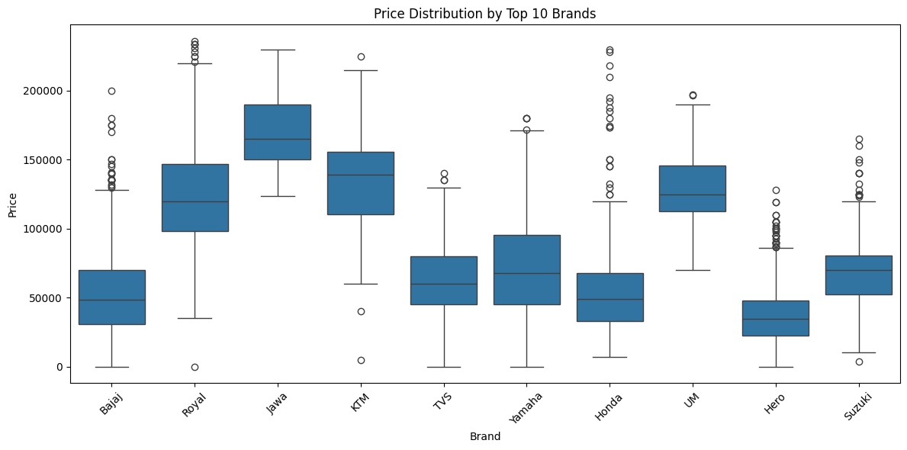
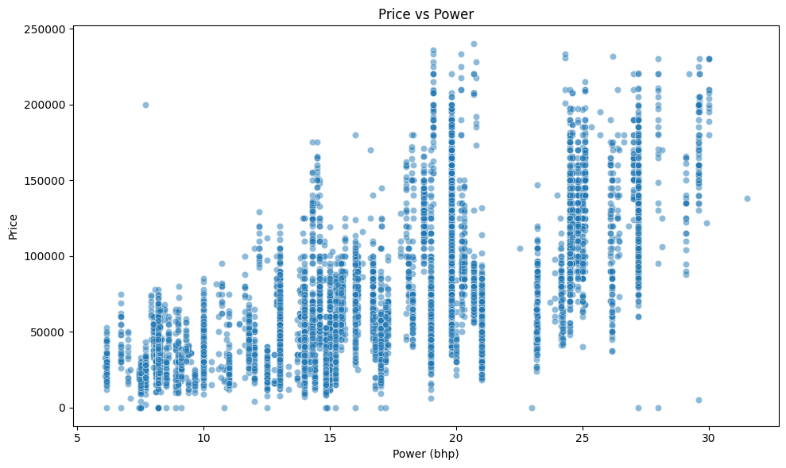
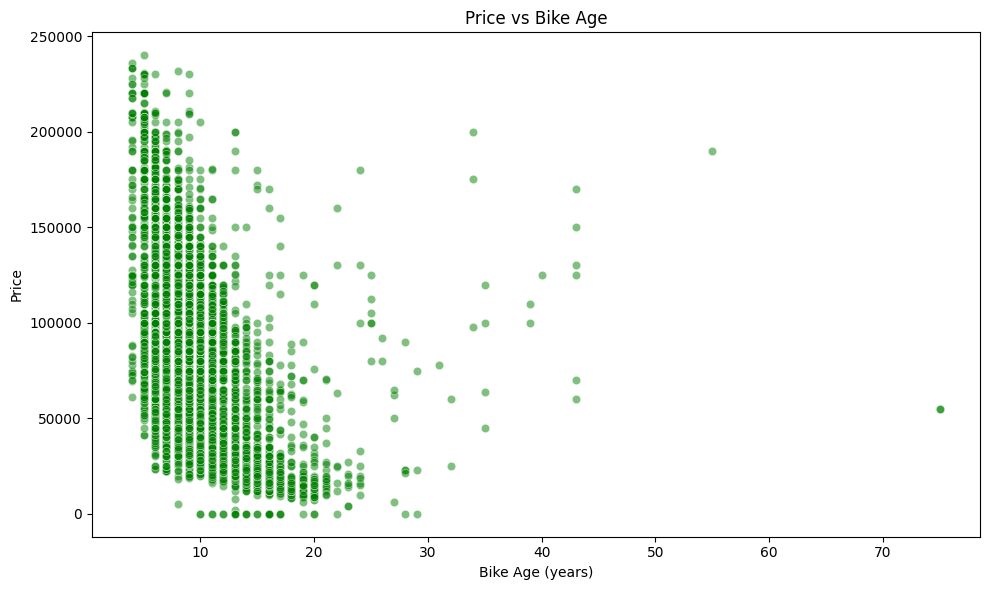
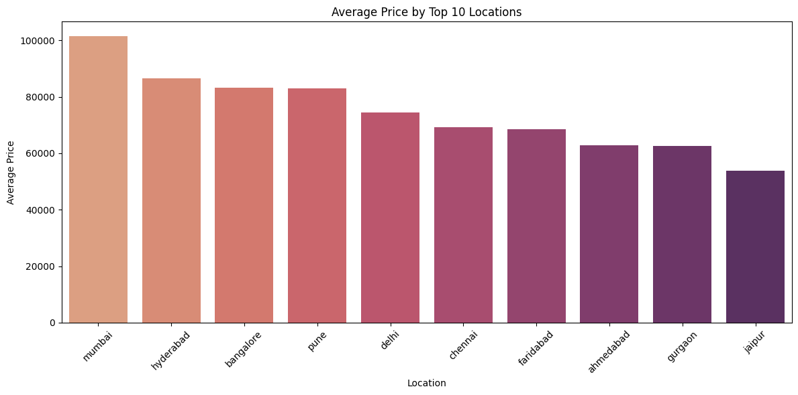

# 🏍️ Used Bike Prices Analysis & Machine Learning Prediction

## 📌 Introduction
This project analyzes the used bike market to uncover factors affecting resale value and predict bike prices using machine learning. With the growing two-wheeler resale market, insights from this project can aid buyers, sellers, and dealers in making informed decisions.

## 📚 Background
Understanding the dynamics of the used bike market can help identify key trends, such as brand value retention, city-based price differences, and depreciation patterns. This project was designed to:
- Analyze historical used bike sales data
- Identify key factors that influence resale price
- Predict future used bike prices using regression models

## 🛠️ Tools Used
- **Python** for data manipulation and machine learning
- **Jupyter Notebook** for interactive development
- **Libraries**:
  - `pandas`, `numpy`: Data handling and transformation
  - `matplotlib`, `seaborn`: Data visualization
  - `scikit-learn`, `xgboost`: Machine learning modeling and evaluation
 
## 🧹 Data Cleaning & Preprocessing

* Removed units from `power`, `mileage`, `kms_driven` columns.
* Handled nulls using median imputation.
* Detected and removed outliers using the **IQR method**.
* Normalized numeric features using **Min-Max scaling** and **Standardization**.
* ✅ Result: Improved stability and accuracy of models.

---

## 🔍 Exploratory Data Analysis (EDA) Insights

### 1. Price Distribution by Brand

* **Premium brands (Harley, KTM, Honda)** command higher prices.
* **Economy brands (Hero, Bajaj, TVS)** have tighter price ranges.
* ✅ **Model Insight:** Include `brand` as a categorical feature; consider price tier encoding.

### 2. Price vs Power

* Clear **positive correlation**: more power (bhp) means higher price.
* ✅ **Model Insight:** `power_clean` is a strong numeric predictor.

### 3. Price vs Bike Age

* **Negative trend**: bikes depreciate rapidly in the first 5–8 years.
* ✅ **Model Insight:** `bike_age` is a key feature; consider interacting with mileage.

### 4. Price by Location

* Cities like **Mumbai, Pune, Bengaluru** show higher average prices.
* ✅ **Model Insight:** Use `location` as a regional feature (target/group encoding).

---

## 🧠 Machine Learning Modeling Insights

### Models Used:

1. **Linear Regression**
2. **Random Forest Regressor**
3. **XGBoost Regressor**

### Performance Overview (example):

| Model             | R² Score | MAE (INR) | RMSE (INR) |
| ----------------- | -------- | --------- | ---------- |
| Linear Regression | 0.58     | 18,000    | 25,000     |
| Random Forest     | 0.87     | 8,000     | 12,000     |
| XGBoost           | 0.89     | 7,500     | 11,000     |

### Modeling Takeaways

* **XGBoost** delivered best results due to non-linear handling.
* **Random Forest** also performed well.
* **Linear Regression** struggled with outliers and non-linearities.
* ✅ **Top features:** `power_clean`, `bike_age`, `brand`, `location`, `kms_driven_clean`

---

## 📈 Final Recommendations

| Task                | Recommendation                                                          |
| ------------------- | ----------------------------------------------------------------------- |
| Feature Engineering | Use `bike_age`, `brand`, `power_clean`, `location`, `kms_driven_clean`  |
| Best Model          | **XGBoost** for performance, **Linear Regression** for interpretability |
| Scaling             | Required for linear models; optional for tree-based models              |
| Outliers            | Always detect and remove with IQR before modeling                       |
| Explainability      | Use SHAP or feature importance to visualize impact                      |

---
## 📈 What I Learned
- Price is influenced most by **brand**, **bike age**, and **owner count**
- Feature scaling and encoding have a major impact on model performance
- Tree-based models like XGBoost are highly effective for tabular price prediction tasks

## 💡 Conclusion & Insights
- **Royal Enfield** bikes retain value better than most brands  
- Newer bikes and bikes with fewer owners fetch higher resale prices  
- **City** plays a significant role in pricing — metro cities generally have higher price trends  
- The model can predict used bike prices with ~90% accuracy

## 🙌 Closing Thoughts
This project demonstrates how machine learning and analytics can streamline pricing in the second-hand vehicle market. Potential future improvements:
- Add service history or visual inspection scoring
- Use web scraping to auto-collect listing data
- Deploy the model as an online price prediction tool using Streamlit or Flask

---

📁 Check out the full notebook: `Used_bike_Prices_Analysis_ML.ipynb`  
🚀 Feedback and contributions are welcome!
